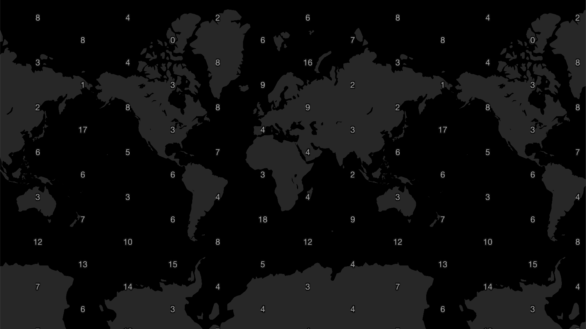

# Grid Layer

Variable rendered as grid of values or symbols (arrows, wind barbs)

### Example



```javascript
import { Deck } from '@deck.gl/core';
import * as WeatherLayers from '@weatherlayers/weatherlayers-gl';

// configure WeatherLayers Cloud client
WeatherLayers.setClientConfig({
  accessToken: 'xxx',
});

const deckgl = new Deck({
  layers: [
    new WeatherLayers.GridLayer({
      // data properties
      dataset: 'gfs/wind_10m_above_ground',
      datetime: '2022-01-01T00:00:00Z',
    }),
  ],
});
```

### Example: Arrows


```javascript
import { Deck } from '@deck.gl/core';
import * as WeatherLayers from '@weatherlayers/weatherlayers-gl';

// configure WeatherLayers Cloud client
WeatherLayers.setClientConfig({
  accessToken: 'xxx',
});

const deckgl = new Deck({
  layers: [
    new WeatherLayers.GridLayer({
      // data properties
      dataset: 'gfs/wind_10m_above_ground',
      datetime: '2022-01-01T00:00:00Z',
      
      // style properties
      style: WeatherLayers.GridStyle.ARROW,
    }),
  ],
});
```

### Example: Wind Barbs


```javascript
import { Deck } from '@deck.gl/core';
import * as WeatherLayers from '@weatherlayers/weatherlayers-gl';

// configure WeatherLayers Cloud client
WeatherLayers.setClientConfig({
  accessToken: 'xxx',
});

const deckgl = new Deck({
  layers: [
    new WeatherLayers.GridLayer({
      // data properties
      dataset: 'gfs/wind_10m_above_ground',
      datetime: '2022-01-01T00:00:00Z',
      
      // style properties
      style: WeatherLayers.GridStyle.WIND_BARB,
    }),
  ],
});
```

### Data Properties

[Data properties](../data.md#data-properties) are common for all layers in the cloud bundle.

### Style Properties

[Style properties](../../standalone-bundle/layers/raster-layer.md#style-properties) are the same as in the standalone bundle.
